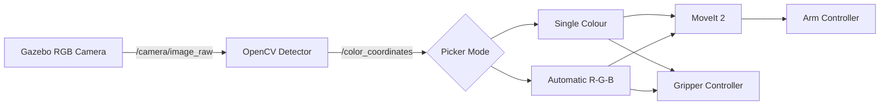

# Panda Color Sorting with ROS 2 and Python

A vision-guided pick-and-place simulation in which a Franka Emika Panda robot detects red, green, and blue boxes, picks each box using MoveIt 2, and places it in the matching container.

The project runs on ROS 2 Jazzy and combines Gazebo Sim, `gz_ros2_control`, MoveIt 2, RViz, OpenCV, TF2, and Python.

## Demo


## Features

- RGB-camera-based detection of red, green, and blue boxes
- HSV segmentation and contour detection with OpenCV
- Camera-to-`panda_link0` coordinate transformation with TF2
- MoveIt 2 motion planning for the Panda arm
- ROS 2 controllers for the arm and gripper
- Single-color pick-and-place mode
- Automatic red → green → blue sorting mode
- Industrial Gazebo environment with graphite worktables, warehouse racks, storage cartons, a workbench, a factory wall, a wall-mounted fan, and safety markings
- Neutral environment colours selected to avoid interfering with RGB object detection

## System Flow



## Workspace Packages

| Package | Purpose |
| --- | --- |
| `panda_description` | Panda URDF/Xacro, meshes, RGB camera, Gazebo models, tables, containers, and industrial world |
| `panda_controller` | `ros2_control` configuration and controller launch files |
| `panda_moveit` | MoveIt 2 planning configuration, `move_group`, and RViz setup |
| `panda_vision` | HSV colour detection and camera-to-robot coordinate conversion |
| `panda_bringup` | Combined Gazebo, controller, MoveIt, RViz, and vision launch file |
| `pymoveit2` | Python MoveIt interface and pick-and-place executables |

## Simulation Environment

The default world is located at:

```text
src/panda_description/worlds/pick_and_place_world.sdf
```

It contains:

- A Franka Emika Panda robot mounted on the workcell
- Six connected graphite-coloured tables in a 3 × 2 layout
- Red, green, and blue dynamic sorting boxes
- Three matching open-top destination containers
- A fixed RGB camera above the work area
- A dark industrial floor and factory wall
- Rear and side warehouse storage racks
- Neutral storage cartons
- An industrial side workbench
- A wall-mounted industrial fan
- Yellow workstation safety markings

The additional industrial objects are placed outside the robot work area and are visual-only, so they do not interfere with robot physics.

## Requirements

- Ubuntu 24.04
- ROS 2 Jazzy
- Gazebo Sim supplied with ROS 2 Jazzy
- MoveIt 2
- `ros2_control` and `gz_ros2_control`
- OpenCV and `cv_bridge`
- NumPy and `tf_transformations`
- `colcon` and `rosdep`

## Clone the Repository

```bash
git clone https://github.com/ruddhro/panda-color-sorting-ros2-python.git
cd panda-color-sorting-ros2-python
```

## Install Dependencies

Source ROS 2 and install the package dependencies:

```bash
source /opt/ros/jazzy/setup.bash
rosdep update
rosdep install --from-paths src --ignore-src -r -y --rosdistro jazzy
```

## Build

```bash
colcon build --symlink-install
source install/setup.bash
```

## Environment Setup

Source ROS 2 and this workspace in every new terminal:

```bash
cd ~/panda-color-sorting-ros2-python
unset AMENT_PREFIX_PATH CMAKE_PREFIX_PATH COLCON_PREFIX_PATH ROS_PACKAGE_PATH PYTHONPATH
source /opt/ros/jazzy/setup.bash
source install/setup.bash
```

> Do not source this Python workspace and another ROS 2 overlay, such as the C++ version of the project, in the same terminal.

## Launch the Simulation

In Terminal 1:

```bash
cd ~/panda-color-sorting-ros2-python
unset AMENT_PREFIX_PATH CMAKE_PREFIX_PATH COLCON_PREFIX_PATH ROS_PACKAGE_PATH PYTHONPATH
source /opt/ros/jazzy/setup.bash
source install/setup.bash
ros2 launch panda_bringup pick_and_place.launch.py
```

Wait until Gazebo, MoveIt, RViz, the camera bridge, and the controllers have finished loading. Keep Terminal 1 running.

## Pick One Colour

Open Terminal 2 and source the workspace:

```bash
cd ~/panda-color-sorting-ros2-python
unset AMENT_PREFIX_PATH CMAKE_PREFIX_PATH COLCON_PREFIX_PATH ROS_PACKAGE_PATH PYTHONPATH
source /opt/ros/jazzy/setup.bash
source install/setup.bash
```

Run one of the following commands.

Red box:

```bash
ros2 run pymoveit2 pick_and_place.py --ros-args -p target_color:=R
```

Green box:

```bash
ros2 run pymoveit2 pick_and_place.py --ros-args -p target_color:=G
```

Blue box:

```bash
ros2 run pymoveit2 pick_and_place.py --ros-args -p target_color:=B
```

## Sort All Colours Automatically

To sort red, green, and blue sequentially:

```bash
ros2 run pymoveit2 pick_all.py
```

Do not run `pick_all.py` and `pick_and_place.py` at the same time.

## Main Parameters

| Parameter | Default | Purpose |
| --- | ---: | --- |
| `target_color` | `R` | Selected box: `R`, `G`, or `B` |
| `pick_hover_height` | `0.50` m | Hand height above the box |
| `grasp_height` | Colour-specific | Hand height while closing the gripper |
| `container_approach_height` | `0.45` m | Hand height above the destination container |
| `container_release_height` | `0.25` m | Hand height used to release the box |

Default grasp heights:

| Colour | Grasp height |
| --- | ---: |
| Red | `0.140 m` |
| Green | `0.125 m` |
| Blue | `0.150 m` |

Example parameter override:

```bash
ros2 run pymoveit2 pick_and_place.py --ros-args \
  -p target_color:=G \
  -p grasp_height:=0.125
```

## Vision Output

The detector publishes `std_msgs/msg/String` messages on `/color_coordinates` using this format:

```text
COLOR_ID,X,Y,Z
```

With the default object positions, the coordinates should be approximately:

```text
R,0.600,0.350,1.100
G,0.600,0.050,1.100
B,0.600,-0.250,1.100
```

The picker uses colour-specific grasp heights because the simulated RGB camera provides an estimated depth value.

## Motion Sequence

For each box, the robot:

1. Moves to the home joint configuration.
2. Moves above the detected box.
3. Opens the gripper.
4. Descends to the colour-specific grasp height.
5. Closes the gripper.
6. Lifts the box.
7. Returns through the home configuration.
8. Moves above the matching container.
9. Lowers the box into the container.
10. Opens the gripper and retreats.
11. Returns to the start configuration.

## Important Topics and Controllers

| Name | Type or purpose |
| --- | --- |
| `/camera/image_raw` | RGB image from Gazebo |
| `/camera/camera_info` | Camera calibration information |
| `/color_coordinates` | Detected colour and calibrated coordinates |
| `/robot_description` | Panda robot model |
| `/joint_states` | Current arm and gripper joint states |
| `/gripper_controller/joint_trajectory` | Gripper trajectory commands |
| `/move_action` | MoveIt planning action |
| `/execute_trajectory` | MoveIt execution action |
| `/arm_controller/follow_joint_trajectory` | Panda arm trajectory action |

## Verify Controllers

```bash
ros2 service call /controller_manager/list_controllers \
  controller_manager_msgs/srv/ListControllers "{}"
```

The following controllers should report `active`:

- `joint_state_broadcaster`
- `arm_controller`
- `gripper_controller`

## Project Layout

```text
panda-color-sorting-ros2-python/
├── .gitignore
├── LICENSE
├── README.md
├── THIRD_PARTY_NOTICES.md
└── src/
    ├── gif/
    ├── panda_bringup/
    ├── panda_controller/
    ├── panda_description/
    │   ├── launch/
    │   ├── meshes/
    │   ├── models/
    │   ├── urdf/
    │   └── worlds/
    ├── panda_moveit/
    ├── panda_vision/
    └── pymoveit2/
```

The generated `build/`, `install/`, and `log/` directories are excluded from Git.

## Customization

- World layout and industrial decoration:
  `src/panda_description/worlds/pick_and_place_world.sdf`
- Table appearance:
  `src/panda_description/models/fancy_table/model.sdf`
- Container geometry:
  `src/panda_description/models/sorting_container*/model.sdf`
- HSV ranges and camera calibration:
  `src/panda_vision/panda_vision/color_detector.py`
- Pick poses, container coordinates, and grasp heights:
  `src/pymoveit2/examples/pick_and_place.py`
- Automatic sorting order:
  `src/pymoveit2/examples/pick_all.py`

Avoid adding saturated red, green, or blue materials inside the camera view because the vision detector may identify them as sorting objects.

After modifying an SDF world or model, stop Gazebo completely, rebuild `panda_description`, source the workspace, and relaunch:

```bash
colcon build --symlink-install --packages-select panda_description
source install/setup.bash
```

## Testing

```bash
colcon test --packages-select \
  panda_description panda_vision pymoveit2 panda_bringup

colcon test-result --verbose
```

## Troubleshooting

### Package or executable not found

Source ROS 2 and the workspace again:

```bash
source /opt/ros/jazzy/setup.bash
source install/setup.bash
```

### Robot does not move

Confirm that the controllers are active and wait until MoveIt has finished starting before running the picker.

### Temporary joint-state warnings

The Python interface may briefly print:

```text
Joint states are not available yet!
```

If it is immediately followed by `Joint states are available now`, operation can continue normally.

### Wrong box coordinate

Compare `/color_coordinates` with the expected values above. Ensure that decorative objects and tables do not use saturated red, green, or blue materials inside the camera view.

### Old environment still appears

Stop Gazebo completely, rebuild `panda_description`, source `install/setup.bash`, and launch the simulation again.

### ROS 2 CLI daemon timeout

If `ros2 action list` or another graph command times out, restart the terminal. If necessary, start the daemon directly:

```bash
python3 -c "from ros2cli.node.daemon import spawn_daemon; print('started =', spawn_daemon(None, timeout=10.0))"
```

## License

The custom `panda_*` packages and project-specific modifications are distributed under the Apache License 2.0. See [LICENSE](./LICENSE).

The bundled `pymoveit2` package is distributed under the BSD 3-Clause License. See [src/pymoveit2/LICENSE](./src/pymoveit2/LICENSE) and [THIRD_PARTY_NOTICES.md](./THIRD_PARTY_NOTICES.md).

## Acknowledgements

- `pymoveit2` was created by Andrej Orsula.
- The initial Panda simulation structure was adapted from [Robotics_ROS2_Gazebo_Projects](https://github.com/xiaohangliuai/Robotics_ROS2_Gazebo_Projects) and extended for ROS 2 Jazzy compatibility, industrial-environment visualization, and tested colour-sorting workflows.

## Disclaimer

This project is intended for simulation, education, and research. Real-robot deployment requires additional safety validation, collision checking, hardware configuration, and emergency-stop procedures.
